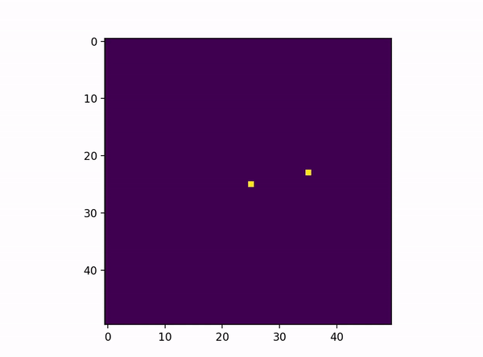

# 2D simulator 

This is a simple numeric simulator of gravity in the 2D space. 


```python
from simulation import Simulation

simulation = Simulation(0.1, terminal=False)
simulation.add_body(mass=1e13, position=(0, 0))
simulation.add_body(mass=1e11, position=(10, 0), velocity=(0, 7))

simulation.run()
```



## License

[MIT](https://choosealicense.com/licenses/mit/)